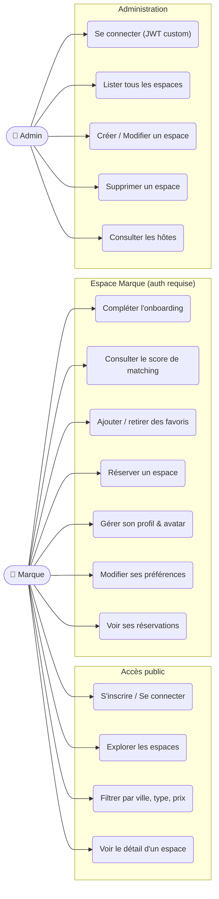
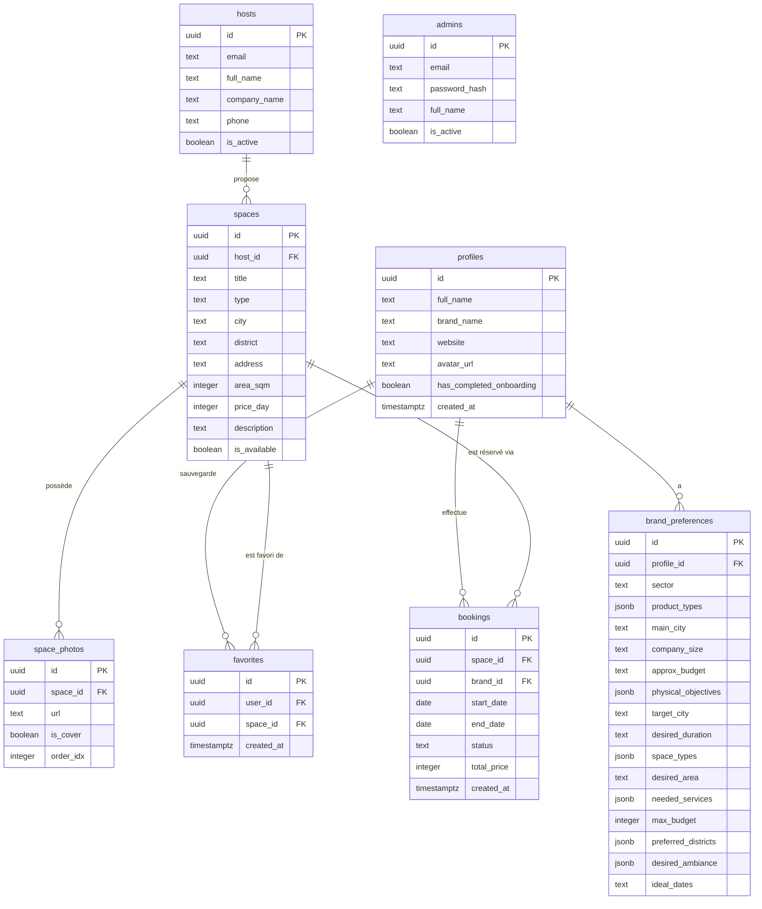

# Phyxel

[](https://nextjs.org)
[](https://react.dev)
[](https://tailwindcss.com)
[](https://supabase.com)
[](https://ui.shadcn.com)

> *donner du sens à vos ventes*


---

## Table des matières

- [Qu'est-ce que Phyxel ?](#quest-ce-que-phyxel-)
- [Stack technique](#stack-technique)
- [Fonctionnalités](#fonctionnalités)
- [Diagramme de cas d'utilisation](#diagramme-de-cas-dutilisation)
- [Architecture du projet](#architecture-du-projet)
- [Schéma de base de données](#schéma-de-base-de-données)
- [Flux d'authentification](#flux-dauthentification)
- [Algorithme de matching](#algorithme-de-matching)
- [Routes disponibles](#routes-disponibles)
- [Installation & démarrage](#installation--démarrage)

---

## Qu'est-ce que Phyxel ?

**Phyxel** est une marketplace qui connecte les marques e-commerce avec des espaces physiques temporaires — pop-up stores, showrooms, corners et boutiques éphémères.

Les marques digitales manquent d'un canal physique pour **tester leurs produits**, **rassurer leurs clients** et **créer des événements mémorables**. Phyxel leur permet de trouver, filtrer et réserver le lieu idéal en quelques clics.

---

## Stack technique

| Technologie | Version | Usage |
|---|---|---|
| **Next.js** | 15.5.18 | Framework full-stack, App Router, Server Actions |
| **React** | 19 | UI library, Server & Client Components |
| **TypeScript** | 5.x | Typage statique |
| **Tailwind CSS** | v4 | Utility-first styling |
| **shadcn/ui** | — | Composants UI accessibles |
| **Supabase** | — | Auth, PostgreSQL, Storage, RLS |
| **Lucide React** | — | Icônes |
| **react-hook-form** | 7.x | Gestion des formulaires |
| **jose** | 6.x | JWT pour l'authentification admin |
| **bcryptjs** | 3.x | Hashage des mots de passe admin |

---

## Fonctionnalités

- **Onboarding wizard 5 étapes** — Parcours guidé post-inscription pour qualifier chaque marque (infos, objectifs, besoins, préférences, résumé).
- **Explorateur d'espaces** — Catalogue filtrable avec cartes interactives, photos, prix/jour et score de matching.
- **Favoris** — Sauvegarde d'espaces favoris avec persistance utilisateur (RLS).
- **Dashboard marque** — Espace personnel : favoris, profil, réservations.
- **Réservation** — Formulaire de réservation avec sélection de dates et calcul automatique du prix total.
- **Score de matching** — Algorithme qui classe les espaces selon les préférences de la marque (ville, type, budget, quartier, surface).
- **Administration CRUD** — Interface admin sécurisée pour gérer les espaces et leurs photos.
- **Middleware intelligent** — Redirections automatiques selon auth, onboarding et rôle admin.
- **RLS & Policies** — Sécurité granulaire au niveau des lignes PostgreSQL.
- **Upload d'avatar** — Les utilisateurs peuvent uploader leur photo de profil via Supabase Storage.

---

## Diagramme de cas d'utilisation



---

## Architecture du projet

```
src/
├── app/                        # App Router — pages et layouts
│   ├── (auth)/                 # Login & Register (layout minimal)
│   ├── (main)/                 # Pages publiques (Navbar + Footer)
│   │   ├── page.tsx            # Page d'accueil
│   │   ├── explorer/           # Explorateur d'espaces
│   │   └── espaces/[id]/       # Détail d'un espace
│   ├── dashboard/              # Espace marque (auth requise)
│   │   ├── page.tsx            # Vue d'ensemble / réservations
│   │   ├── favoris/            # Espaces sauvegardés
│   │   └── profil/             # Profil & préférences
│   ├── onboarding/             # Wizard d'onboarding (5 étapes)
│   ├── admin/                  # Backoffice (JWT admin requis)
│   │   ├── login/
│   │   └── espaces/            # CRUD espaces
│   └── api/                    # API REST (Next.js Route Handlers)
│       ├── auth/               # signIn, signUp, signOut
│       ├── spaces/             # CRUD espaces + photos
│       ├── bookings/           # CRUD réservations
│       ├── profiles/           # Mise à jour profil
│       └── admin/              # Endpoints admin (spaces, hosts)
│
├── components/
│   ├── ui/                     # Primitives : Button, Card, Input…
│   ├── layout/                 # Navbar, Footer
│   ├── sections/               # Sections de la landing page
│   └── features/               # Composants métier
│       ├── OnboardingWizard    # Wizard multi-étapes
│       ├── BookingForm         # Formulaire de réservation
│       ├── SearchBar           # Filtres explorateur
│       ├── SpaceGrid           # Grille d'espaces
│       ├── PhotoGallery        # Galerie photos
│       └── MatchWidget         # Affichage du score de matching
│
├── lib/
│   ├── supabase/               # Clients Supabase (client, server, admin, middleware)
│   ├── queries/                # Fonctions de requête BDD (spaces, users, favorites…)
│   ├── admin/                  # Auth admin (JWT, session, bcrypt)
│   └── matching/               # Algorithme de scoring (score.ts, scoreColors.ts)
│
├── hooks/                      # Hooks React (useAuth, useProfile, useFavorite…)
├── types/                      # Types TypeScript (database, spaces, users, onboarding)
├── constants/                  # Constantes app (types d'espaces, villes, statuts…)
└── middleware.ts               # Refresh de session Supabase + redirections
```

---

## Schéma de base de données



> **RLS activée** sur toutes les tables utilisateur. Les `admins` et `hosts` sont gérés exclusivement côté serveur (service role).

---

## Flux d'authentification

### Marque (Supabase Auth)

```
Inscription (/register)
  └─▶ Supabase Auth crée l'utilisateur
        └─▶ Trigger handle_new_user() insère un profil dans `profiles`
              └─▶ Middleware redirige vers /onboarding
                    └─▶ Onboarding complété → has_completed_onboarding = true
                          └─▶ Accès à /explorer et /dashboard
```

### Admin (JWT custom)

```
/admin/login
  └─▶ Vérification email + bcrypt(password, password_hash) sur table `admins`
        └─▶ JWT signé (jose) stocké en cookie HttpOnly
              └─▶ Middleware vérifie le JWT à chaque requête /admin/*
                    └─▶ Accès au backoffice /admin/espaces
```

---

## Algorithme de matching

Le score de matching (0–100) est calculé dans `src/lib/matching/score.ts` en comparant les préférences de la marque avec les caractéristiques de chaque espace.

| Critère | Points max | Détail |
|---|---|---|
| Ville cible | 30 pts | Correspondance exacte sur `target_city` |
| Type d'espace | 25 pts | Correspondance sur `space_types` préférés |
| Budget max | 20 pts | `price_day` ≤ `max_budget` |
| Quartier | 15 pts | Correspondance sur `preferred_districts` |
| Surface | 10 pts | `area_sqm` dans la fourchette `desired_area` |

Le `MatchWidget` affiche également les **points forts** et **avertissements** détaillés par critère.


## Routes disponibles

### Routes publiques

| Route | Description |
|---|---|
| `/` | Page d'accueil (hero, espaces en vedette, comment ça marche) |
| `/login` | Connexion marque |
| `/register` | Inscription marque |
| `/explorer` | Catalogue d'espaces avec filtres et matching |
| `/espaces/[id]` | Détail d'un espace (galerie, prix, réservation) |
| `/reservation-confirmee` | Confirmation de réservation |
| `/admin/login` | Connexion backoffice admin |

### Routes marque (auth requise)

| Route | Description |
|---|---|
| `/onboarding` | Wizard de qualification en 5 étapes |
| `/dashboard` | Vue d'ensemble des réservations et notifications |
| `/dashboard/favoris` | Espaces sauvegardés |
| `/dashboard/reservations` | Historique des réservations |
| `/dashboard/profil` | Édition du profil et avatar |
| `/dashboard/profil/preferences` | Modification des préférences de matching |

### Routes admin (JWT requis)

| Route | Description |
|---|---|
| `/admin/espaces` | Liste de tous les espaces (édition, suppression) |
| `/admin/espaces/nouveau` | Création d'un nouvel espace |
| `/admin/espaces/[id]/modifier` | Modification d'un espace existant |